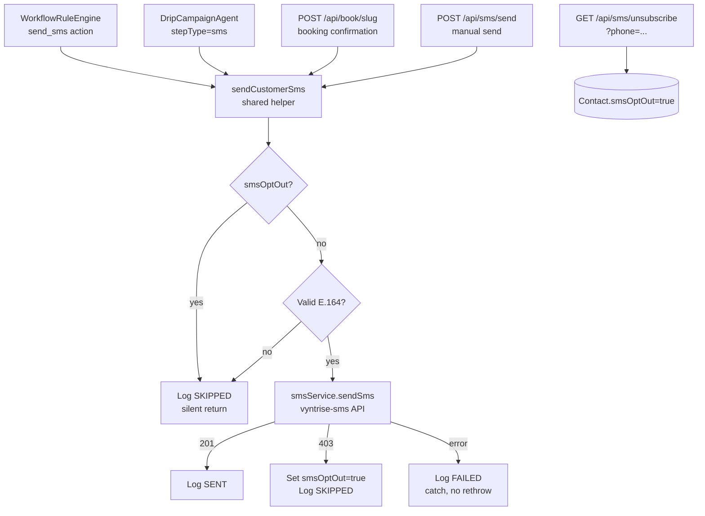

# Customer SMS Messaging — Design

## Overview

This feature extends the Vyntrize CRM to send outbound SMS messages to customers (contacts/leads) through the same automation paths that already send email. The implementation reuses the existing `smsService` transport layer (currently used only for internal staff notifications) and mirrors the email system's architecture throughout: a shared helper function, a log table, a validation/opt-out guard, workflow rule engine support, drip campaign support, booking confirmation integration, and manual send/unsubscribe endpoints.

The core design principle is **minimal surface area** — no new SMS provider, no new transport abstraction, no UI changes beyond what is described in the requirements. Every touch point routes through a single `sendCustomerSms()` helper so that opt-out enforcement, E.164 validation, logging, and error isolation are guaranteed in one place.

---

## Architecture



All SMS delivery flows go through `sendCustomerSms()`. The function is fire-and-forget — it never throws. Callers do not need try/catch for the SMS step.

---

## Components and Interfaces

### 1. `sendCustomerSms()` — Shared Helper

**File:** `apps/vyntrize-crm/lib/sms/send-customer-sms.ts`

This is the single entry point for all customer-facing SMS sends. It encapsulates opt-out checking, E.164 validation, template rendering, smsService invocation, 403 opt-out backfill, and SmsLog creation.

```typescript
export interface CustomerSmsOptions {
  /** E.164 phone number (or raw string — will be validated internally) */
  to: string | null | undefined;
  /** Plain text message body, may contain {{variable}} tokens */
  message: string;
  /** Template variables for {{variable}} substitution */
  variables?: TemplateVariables;
  /** Used to associate the log entry with a lead */
  leadId?: string;
  /** Used to associate the log entry with a contact (also used for opt-out lookup) */
  contactId?: string;
}

export interface CustomerSmsResult {
  sent: boolean;
  skipped: boolean;
  failed: boolean;
  messageId?: string;
  error?: string;
}

export async function sendCustomerSms(options: CustomerSmsOptions): Promise<CustomerSmsResult>
```

**Internal logic (in order):**

1. **Config gate** — call `smsService.getConfig()`. If `null`, log SKIPPED and return.
2. **Phone presence check** — if `to` is null/empty, log SKIPPED and return.
3. **E.164 validation** — test `/^\+[1-9]\d{6,14}$/.test(to)`. If invalid, log SKIPPED and return.
4. **smsOptOut check** — if `contactId` provided, query `prisma.contact.findUnique({ where: { id: contactId } })`. If `smsOptOut === true`, log SKIPPED and return.
5. **Template rendering** — if `variables` provided, call `TemplateRenderer.render(message, variables)`.
6. **Send** — call `smsService.sendSms({ to, content: renderedMessage })`.
7. **403 backfill** — if result has `skipped: true`, set `Contact.smsOptOut = true` for `contactId` if available.
8. **Log** — create `SmsLog` row with appropriate status (`SENT` | `FAILED` | `SKIPPED`).
9. **Return** — never throw; return result struct.

Error handling wraps the entire function body in a try/catch. Any uncaught error logs FAILED and returns `{ sent: false, skipped: false, failed: true, error }`.

---

### 2. `GET /api/sms/unsubscribe` Route

**File:** `apps/vyntrize-crm/app/api/sms/unsubscribe/route.ts`

Public (no auth required). Accepts `?phone=<E164>`. Finds the matching contact by `phone` field, sets `smsOptOut = true`, returns a plain-text confirmation.

```typescript
export async function GET(request: NextRequest): Promise<Response>
```

- Query param `phone` is required. If missing or malformed, return `400 Bad Request` plain text.
- Lookup: `prisma.contact.findFirst({ where: { phone: decodedPhone } })`.
- If not found: return `200` with a neutral "You have been unsubscribed" message (do not reveal whether the number exists).
- If found: `prisma.contact.update({ where: { id }, data: { smsOptOut: true } })`.
- Response: `200 text/plain` — "You have been unsubscribed from SMS messages."

---

### 3. `POST /api/sms/send` Route

**File:** `apps/vyntrize-crm/app/api/sms/send/route.ts`

Authenticated (session required). Mirrors `POST /api/email/send`.

**Request body:**
```typescript
interface ManualSmsRequest {
  to: string;           // required, E.164
  toName?: string;
  message: string;      // required, plain text
  contactId?: string;
  leadId?: string;
}
```

**Logic:**
1. Check session — return `401` if not logged in.
2. Validate `to` — E.164 regex; return `400` with `{ error: 'Invalid phone number format' }` if bad.
3. If `contactId` provided, query contact and check `smsOptOut`; return `400 { error: 'Contact has opted out of SMS' }` if true.
4. Call `sendCustomerSms({ to, message, contactId, leadId })`.
5. Return `200 { success: true, messageId }` on success, `500` on failure.

---

### 4. Workflow Rule Engine — `send_sms` Action

**File:** `apps/vyntrize-crm/lib/agents/workflow-rule-engine.ts` (modified)

A new `case 'send_sms':` branch is added to `executeAction()`. The action resolves the contact's phone number from the lead and delegates to `sendCustomerSms()`.

```typescript
case 'send_sms': {
  const { message, templateHint } = action.config as { message: string; templateHint?: string };
  const contact = await prisma.contact.findUnique({ where: { id: lead.contactId } });

  if (rule.autonomyLevel === 'SUGGEST_APPROVE') {
    // Create pending AgentAction for human review
    await prisma.agentAction.create({
      data: {
        agentType: AgentType.WORKFLOW_RULE,
        actionType: ActionType.SMS_SEND,
        leadId: lead.id,
        reasoning: `Pending SMS approval for rule "${rule.name}"`,
        autonomyLevel: AutonomyLevel.SUGGEST_APPROVE,
        status: ActionStatus.PENDING,
        metadata: { ruleId: rule.id, ruleName: rule.name, message, templateHint },
      },
    });
    break;
  }

  // FULLY_AUTONOMOUS — send immediately
  const templateVars = buildSmsTemplateVars(contact, lead);
  await sendCustomerSms({
    to: contact?.phone,
    message,
    variables: templateVars,
    leadId: lead.id,
    contactId: contact?.id,
  });
  break;
}
```

The `buildSmsTemplateVars()` helper constructs the standard variable set: `{ firstName, lastName, company, bookingLink, optOutUrl }`.

---

### 5. Drip Campaign Agent — SMS Steps

**File:** `apps/vyntrize-crm/lib/agents/drip-campaign-agent.ts` (modified)

The `processStep()` method gains a branch on `(currentStep as any).stepType ?? 'email'`.

**Email path** — unchanged existing logic.

**SMS path:**
```typescript
const stepType = (currentStep as any).stepType ?? 'email';

if (stepType === 'sms') {
  const contact = (lead as LeadWithContact).contact;
  const templateVars = buildSmsTemplateVars(contact, lead);
  await sendCustomerSms({
    to: contact.phone,
    message: currentStep.bodyTemplate,
    variables: templateVars,
    leadId: lead.id,
    contactId: contact.id,
  });

  // Record SMS_SEND AgentAction
  await this.recordAction(ActionType.SMS_SEND, lead.id, `Drip SMS step ${currentStep.stepOrder}`, ...);

} else {
  // Existing email logic ...
}
```

**Branch condition override for SMS steps:** In `checkBranchCondition()`, if the step being evaluated has `stepType === 'sms'` and the condition is `opened` or `not_opened`, return `true` (always proceed). This is implemented by passing the step type into the branch check.

**Opt-out skip (continue enrollment):** `sendCustomerSms()` already handles the opt-out skip silently. The enrollment advancement logic runs regardless of send outcome — the enrollment step index is always incremented.

---

### 6. Booking Confirmation SMS Integration

**File:** `apps/vyntrize-crm/app/api/book/[slug]/route.ts` (modified)

After the existing `sendBookingConfirmation()` call, a non-blocking SMS send is added:

```typescript
// 5. Send booking confirmation email (existing)
await sendBookingConfirmation({ ... });

// 6. Send booking confirmation SMS (fire-and-forget — does not block or throw)
if (contact.phone) {
  const smsMessage = buildBookingConfirmationSms({
    hostName: user.displayName,
    startTime: event.startTime,
    meetLink: event.meetLink ?? undefined,
    optOutUrl: `${process.env.NEXT_PUBLIC_CRM_URL}/api/sms/unsubscribe?phone=${encodeURIComponent(contact.phone)}`,
  });
  await sendCustomerSms({
    to: contact.phone,
    message: smsMessage,
    contactId: contact.id,
    leadId: lead.id,
  });
}
```

`buildBookingConfirmationSms()` is a small pure function in `lib/sms/booking-sms.ts` that produces a plain-text string containing date, time, host name, and Meet link. It has no external dependencies.

---

### 7. Automation Schema Changes

**File:** `apps/vyntrize-crm/lib/automation/schemas.ts` (modified)

**`ruleActionSchema`** — a new member added to the discriminated union:

```typescript
z.object({
  type: z.literal('send_sms'),
  config: z.object({
    message: z.string().min(1, 'Message is required'),
    templateHint: z.string().optional(),
  }),
}),
```

**`dripStepInputSchema`** — `stepType` field added (backward-compatible optional with default):

```typescript
export const dripStepInputSchema = z.object({
  stepOrder: z.number().int().min(0),
  delayHours: z.number().int().min(0),
  stepType: z.enum(['email', 'sms']).optional().default('email'),
  subjectTemplate: z.string().min(1),
  bodyTemplate: z.string().min(1),
  branchCondition: z.enum(['opened', 'not_opened', 'clicked', 'always']),
});
```

The `subjectTemplate` field remains required at the schema level for backward compatibility but is treated as unused/empty string for SMS steps at runtime.

---

### 8. `buildSmsTemplateVars()` Helper

**File:** `apps/vyntrize-crm/lib/sms/sms-template-vars.ts`

```typescript
export function buildSmsTemplateVars(
  contact: Contact | null | undefined,
  lead: Lead & { contact?: Contact }
): TemplateVariables {
  const crmBase = process.env.NEXT_PUBLIC_CRM_URL ?? 'https://crm.vyntrize.com';
  const phone = contact?.phone ?? '';
  return {
    firstName:   contact?.firstName ?? '',
    lastName:    contact?.lastName ?? '',
    company:     contact?.company?.name ?? '',
    bookingLink: lead.assigneeId
      ? `${crmBase}/book/${lead.assigneeId}`
      : '',
    optOutUrl:   phone
      ? `${crmBase}/api/sms/unsubscribe?phone=${encodeURIComponent(phone)}`
      : '',
  };
}
```

---

## Data Models

### New: `SmsLog` table

Mirrors `EmailLog`. Records every customer SMS attempt.

```prisma
model SmsLog {
  id          String    @id @default(cuid())
  createdAt   DateTime  @default(now())
  updatedAt   DateTime  @updatedAt

  // Recipient
  toPhone     String
  toName      String?

  // Content
  content     String    @db.Text

  // Delivery
  status      SmsStatus @default(QUEUED)
  messageId   String?           // returned by vyntrise-sms on success
  sentAt      DateTime?
  errorMessage String?  @db.Text

  // CRM relations
  contactId   String?
  contact     Contact?  @relation(fields: [contactId], references: [id])
  leadId      String?
  lead        Lead?     @relation(fields: [leadId], references: [id], name: "SmsLogLead")

  @@index([contactId])
  @@index([leadId])
  @@index([status])
  @@index([createdAt])
  @@map("sms_logs")
}

enum SmsStatus {
  QUEUED
  SENT
  FAILED
  SKIPPED
}
```

### Modified: `Contact` model

Add `smsOptOut` field:

```prisma
model Contact {
  // ... existing fields ...
  smsOptOut   Boolean   @default(false)
  smsLogs     SmsLog[]
  // ... rest of relations ...
}
```

### Modified: `DripStep` model

Add optional `stepType` field (backward-compatible):

```prisma
model DripStep {
  // ... existing fields ...
  stepType    String    @default("email")   // 'email' | 'sms'
  // ... rest of fields ...
}
```

### Modified: `Lead` model

Add `smsLogs` relation:

```prisma
model Lead {
  // ... existing fields ...
  smsLogs     SmsLog[]  @relation("SmsLogLead")
  // ... rest of relations ...
}
```

### Modified: `ActionType` enum

Add `SMS_SEND` to the existing enum:

```prisma
enum ActionType {
  // ... existing values ...
  SMS_SEND
}
```

---

## Correctness Properties

*A property is a characteristic or behavior that should hold true across all valid executions of a system — essentially, a formal statement about what the system should do. Properties serve as the bridge between human-readable specifications and machine-verifiable correctness guarantees.*

### Property 1: SMS attempt always produces a SmsLog entry

*For any* call to `sendCustomerSms()` with any combination of phone, message, contact, and lead — regardless of whether the send succeeds, fails, is skipped due to opt-out, or is skipped due to invalid phone — a `SmsLog` row MUST be created with the correct status (`SENT`, `FAILED`, or `SKIPPED`).

**Validates: Requirements 1.2**

---

### Property 2: Invalid or absent phone numbers are always skipped

*For any* string that does not match the E.164 regex `/^\+[1-9]\d{6,14}$/` (including null, empty string, domestic-format numbers, and malformed values), calling `sendCustomerSms()` with that value as `to` MUST produce a SKIPPED log entry and MUST NOT invoke `smsService.sendSms()`.

**Validates: Requirements 1.3**

---

### Property 3: Opted-out contacts are always skipped

*For any* contact where `smsOptOut = true`, calling `sendCustomerSms()` with that contact's `contactId` MUST produce a SKIPPED log entry and MUST NOT invoke `smsService.sendSms()`. This holds regardless of the phone number's validity or the message content.

**Validates: Requirements 1.4**

---

### Property 4: Unsubscribe endpoint always sets smsOptOut

*For any* phone number that matches a contact's `phone` field, a `GET /api/sms/unsubscribe?phone=<number>` request MUST result in that contact's `smsOptOut` being set to `true` in the database.

**Validates: Requirements 1.6**

---

### Property 5: Template rendering always replaces all {{variable}} tokens

*For any* message string containing `{{variable}}` tokens and any matching variables object, `TemplateRenderer.render(message, variables)` MUST produce a string where every `{{key}}` whose key exists in the variables object has been replaced with the corresponding value, and no unreplaced `{{key}}` tokens remain for keys that were provided.

**Validates: Requirements 2.1**

---

### Property 6: Content length is always enforced

*For any* message content of any length, the content delivered to `smsService.sendSms()` MUST be at most 1600 characters. Content exceeding 1600 characters MUST be truncated and end with `'...'`.

**Validates: Requirements 2.3**

---

### Property 7: send_sms Zod schema accepts valid configs and rejects invalid ones

*For any* object with `type: 'send_sms'` and `config.message` as a non-empty string, `ruleActionSchema.parse()` MUST succeed. *For any* object with `type: 'send_sms'` and a missing or empty `config.message`, `ruleActionSchema.parse()` MUST throw a `ZodError`.

**Validates: Requirements 3.2, 3.6**

---

### Property 8: send_sms skip does not halt rule execution

*For any* workflow rule containing a `send_sms` action followed by other actions, where the target contact has `smsOptOut = true` or no valid phone number, the subsequent actions in the same rule MUST still execute. The skip of the SMS step MUST NOT propagate an error or short-circuit the rule.

**Validates: Requirements 3.5**

---

### Property 9: SMS drip steps never call email send path

*For any* `DripStep` with `stepType = 'sms'`, the drip campaign agent's `processStep()` MUST invoke `sendCustomerSms()` and MUST NOT call `emailService.sendEmail()`.

**Validates: Requirements 4.2**

---

### Property 10: opened/not_opened branch conditions always pass for SMS steps

*For any* `DripStep` with `stepType = 'sms'` and `branchCondition` of `'opened'` or `'not_opened'`, the branch condition evaluation MUST return `true` (proceed), regardless of the lead's email open history.

**Validates: Requirements 4.3**

---

### Property 11: SMS drip step skip advances enrollment (does not stop it)

*For any* drip enrollment where the contact has `smsOptOut = true`, processing an SMS drip step MUST advance `currentStepIndex` and leave the enrollment in `ACTIVE` status. The enrollment MUST NOT be stopped or marked COMPLETED solely because of the SMS opt-out.

**Validates: Requirements 4.5**

---

### Property 12: Booking confirmation SMS content contains required fields

*For any* booking confirmation (any host name, start time, end time, and optional Meet link), the SMS message generated by `buildBookingConfirmationSms()` MUST contain the host name, a representation of the start time, and — when a Meet link is present — that Meet link.

**Validates: Requirements 5.2**

---

### Property 13: SMS failures never propagate exceptions to callers

*For any* error thrown by `smsService.sendSms()` (network timeout, HTTP 500, JSON parse failure, etc.), `sendCustomerSms()` MUST catch the error, log a FAILED `SmsLog` entry, and return a result struct with `failed: true`. It MUST NOT rethrow the error.

**Validates: Requirements 7.1**

---

## Error Handling

### Error Isolation Guarantee

`sendCustomerSms()` is the single error boundary for all customer SMS. All internal errors are caught and converted to a result struct. Callers (booking route, workflow rule engine, drip agent) need no try/catch for the SMS step.

### 403 From Provider (Recipient Opted Out at Provider Level)

`smsService.sendSms()` already returns `{ success: true, skipped: true }` for HTTP 403 (matching the existing behavior). `sendCustomerSms()` detects `skipped: true` and:
1. Updates `Contact.smsOptOut = true` (if `contactId` is known)
2. Logs status `SKIPPED`

This is not counted as a failure — it is a normal business outcome.

### Missing Configuration

If `smsService.getConfig()` returns `null` (neither `VYNTRIZE_SMS_API_KEY` env var nor `SMS_CONFIG` SystemSetting is present), `sendCustomerSms()` logs SKIPPED with a `'SMS service not configured'` note and returns immediately. No send is attempted.

### Invalid E.164

Invalid phone numbers are logged as SKIPPED with `'Invalid phone format'` in the error field. The invalid number is not passed to `smsService` to avoid API errors.

### Drip Campaign Error Isolation

If `sendCustomerSms()` itself somehow throws (defensive programming), `processStep()` wraps the SMS branch in a try/catch that logs the error and still advances the enrollment index. This ensures drip sequences are never blocked by SMS errors.

### Workflow Rule Error Isolation

The existing `for (const action of actions)` loop in `WorkflowRuleEngine.executeAction()` already catches per-action errors and continues to the next action. The `send_sms` case follows the same pattern.

---

## Testing Strategy

### Unit Tests

- `sendCustomerSms()` with mocked `smsService` and mocked Prisma:
  - Null/empty phone → SKIPPED log, no sendSms call
  - Invalid phone string → SKIPPED log, no sendSms call
  - Valid phone, `smsOptOut=true` contact → SKIPPED log, no sendSms call
  - Valid phone, opt-in contact, sendSms succeeds → SENT log, correct messageId
  - Valid phone, sendSms throws → FAILED log, no rethrow
  - Valid phone, sendSms returns `skipped: true` (403) → Contact.smsOptOut set, SKIPPED log
  - No smsService config → SKIPPED log, no sendSms call
- `buildBookingConfirmationSms()`: verify output contains host name, time, and meet link
- `buildSmsTemplateVars()`: verify all expected keys are present in output
- `TemplateRenderer.render()` (existing, extend with SMS-specific examples): verify token substitution
- `ruleActionSchema` parsing: valid send_sms passes, invalid (missing message) fails

### Property-Based Tests

Using **fast-check** (already likely in scope for a TypeScript project; add as devDependency if absent).

Each property test runs a minimum of **100 iterations**.

```typescript
// Tag format: Feature: customer-sms, Property N: <property text>
```

- **Property 1** (SmsLog always created): Generate random `CustomerSmsOptions` with arbitrary phone strings, messages, and contactIds. Mock Prisma and smsService. Assert `prisma.smsLog.create` is called exactly once with the correct status.

- **Property 2** (Invalid phone → SKIPPED): Generate non-E.164 strings using fc.string() and fc.constant(null/undefined/''). Assert SKIPPED log and no smsService call.

- **Property 3** (Opted-out → SKIPPED): Generate arbitrary valid phones and messages. Mock contact with `smsOptOut=true`. Assert SKIPPED log and no smsService call.

- **Property 4** (Unsubscribe endpoint): Generate valid E.164 strings. For each, create a mock contact, call the endpoint handler, assert `smsOptOut=true` update was called.

- **Property 5** (Template rendering): Generate random templates with `{{key}}` tokens and matching variables objects. Assert all provided keys are replaced in output.

- **Property 6** (Content length): Generate strings of lengths from 0 to 3000. Pass through the content-guard logic. Assert output length ≤ 1600 and, if truncated, ends with `'...'`.

- **Property 7** (Zod schema): Generate `send_sms` config objects with fc.record(). Assert parse succeeds when `config.message` is non-empty string, fails otherwise.

- **Property 8** (Skip does not halt rule): Generate mock leads with opted-out contacts. Run executeAction with send_sms + a subsequent create_task. Assert create_task was still executed.

- **Property 9** (SMS drip step → sendCustomerSms, not emailService): Generate DripSteps with `stepType='sms'`. Mock both services. Assert `sendCustomerSms` called, `emailService.sendEmail` not called.

- **Property 10** (opened/not_opened → always true for SMS): Generate SMS DripSteps with `branchCondition` in `['opened', 'not_opened']`. Assert `checkBranchCondition` returns `true`.

- **Property 11** (SMS skip advances enrollment): Generate enrollments with opted-out contacts and SMS steps. Assert `currentStepIndex` incremented and enrollment remains ACTIVE.

- **Property 12** (Booking SMS content): Generate booking data with fc.record(). Call `buildBookingConfirmationSms()`. Assert presence of host name and time in output.

- **Property 13** (No exception propagation): Generate arbitrary Error instances. Mock `smsService.sendSms` to throw them. Assert `sendCustomerSms` resolves (not rejects) and returns `{ failed: true }`.

### Integration Tests

- `POST /api/book/[slug]` with phone number in body — verify `SmsLog` row created (using real Prisma, mocked `smsService` HTTP call)
- `GET /api/sms/unsubscribe?phone=...` — verify `Contact.smsOptOut` updated in test DB
- `POST /api/sms/send` — authenticated request, verify `SmsLog` created and response contains `messageId`
- Workflow rule with `send_sms` + `create_task` actions, opted-out contact — verify task still created, SMS skipped

### Smoke Tests

- `GET /api/notifications/channels/status` — verify `sms.configured` field is present and boolean
- Verify `ActionType.SMS_SEND` is accepted by the Prisma `AgentAction` model (schema migration check)
